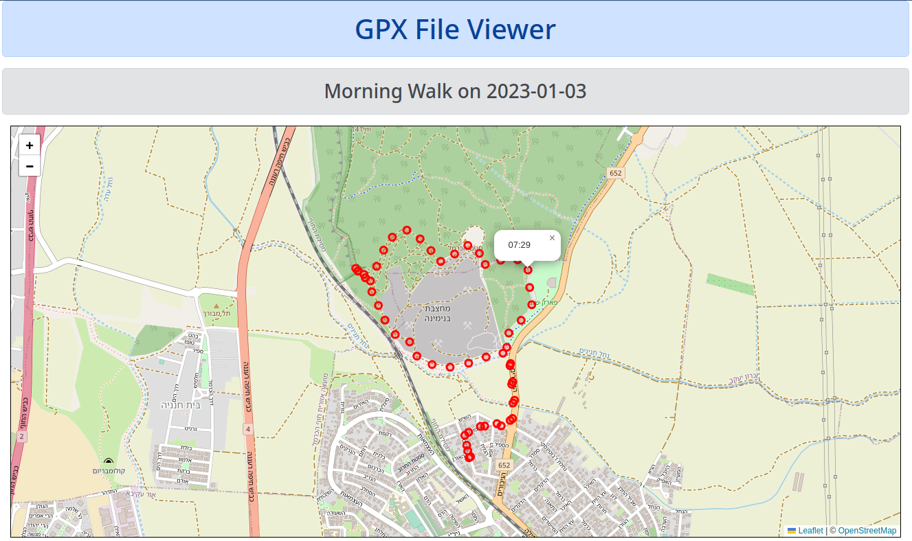

# Visualizing Map Data with Leaflet JS
+++
title = "Visualizing Map Data with Leaflet JS"
date = "FIXME"
tags = ["golang"]
categories = [ "golang" ]
url = "FIXME"
author = "mikit"
+++

### Overview

I'm close to my goal of hitting 1,000 kilometer of walking this year.
Whenever I walk a new route, I like to record it. The data that comes out of the recording application ([Strava](https://www.strava.com/dashboard) in my case) is in [GPX format](https://en.wikipedia.org/wiki/GPS_Exchange_Format).
Starva does visualize the route, but I like to do it on my own as well.
Which brought me to this blog post about using [Leaflet JS](https://leafletjs.com/) to visualize GPX data.

We're going to write an HTTP server that accepts a GPX file and returns an interactive map showing the points in the GPX.
The map will look like:



### Raw Data

Let's start by having a look at the GPX file first


**Listing 1: Morning_Walk.gpx**

```
01 <?xml version="1.0" encoding="UTF-8"?>
02 <gpx creator="StravaGPX Android" xmlns:xsi="http://www.w3.org/2001/XMLSchema-instance" xsi:schemaLocation="http://www.topografix.com/GPX/1/1 http://www.topografix.com/GPX/1/1/gpx.xsd" version="1.1" xmlns="http://www.topografix.com/GPX/1/1">
03  <metadata>
04   <time>2023-01-03T06:50:42Z</time>
05  </metadata>
06  <trk>
07   <name>Morning Walk</name>
08   <type>walking</type>
09   <trkseg>
10    <trkpt lat="32.5254730" lon="34.9429370">
11     <ele>19.5</ele>
12     <time>2023-01-03T06:50:42Z</time>
13    </trkpt>
14    <trkpt lat="32.5254790" lon="34.9429480">
15     <ele>19.5</ele>
16     <time>2023-01-03T06:50:43Z</time>
17    </trkpt>
...
10410   </trkseg>
10411  </trk>
10412 </gpx>
```

Listing 1 shows a truncated version of `Morning_Walk.gpx`. You can see it's an XML format and the location data is in `trkpt` elements under `trkseg` element.

Let's run a quick query to see how many points are in this file:

**Listing 2: Number of Points**

```
$ grep '<trkpt' Morning_Walk.gpx| wc -l
2600
```

In listing 2 you use `grep` and `wc` to find how many points are in the GPX files. You can see it's 2,600 points which is too much to display. You are going to aggregate points by the minute in order to reduce the number of points on the map.

_Note: Parsing XML with grep is not the best option, for this quick and dirty look it OK, but you should probably use tools such as [XMLStarlet](https://xmlstar.sourceforge.net/)_

### Parsing GPX

Let's start by parsing the GPX file using the build-in `encoing/xml` package.

**Listing 3: Parsing GPX**

```
09 // Point is a point in GPX data.
10 type Point struct {
11     Lat  float64
12     Lng  float64
13     Time time.Time
14 }
15 
16 // GPX is data in GPX file.
17 type GPX struct {
18     Name   string
19     Time   time.Time
20     Points []Point
21 }
22 
23 // ParseGPX parses GPX file, returns GPX.
24 func ParseGPX(r io.Reader) (GPX, error) {
25     var xmlData struct {
26         Meta struct {
27             Time time.Time `xml:"time"`
28         } `xml:"metadata"`
29         Trk struct {
30             Name    string `xml:"name"`
31             Segment struct {
32                 Points []struct {
33                     Lat  float64   `xml:"lat,attr"`
34                     Lon  float64   `xml:"lon,attr"`
35                     Time time.Time `xml:"time"`
36                 } `xml:"trkpt"`
37             } `xml:"trkseg"`
38         } `xml:"trk"`
39     }
40 
41     dec := xml.NewDecoder(r)
42     if err := dec.Decode(&xmlData); err != nil {
43         return GPX{}, err
44     }
45 
46     gpx := GPX{
47         Name:   xmlData.Trk.Name,
48         Time:   xmlData.Meta.Time,
49         Points: make([]Point, len(xmlData.Trk.Segment.Points)),
50     }
51 
52     for i, pt := range xmlData.Trk.Segment.Points {
53         gpx.Points[i].Lat = pt.Lat
54         gpx.Points[i].Lng = pt.Lon
55         gpx.Points[i].Time = pt.Time
56     }
57 
58     return gpx, nil
59 }
```

Listing 3 shows how to parse a GPX file. On lines 10 and 17 you define the `Point` and `GPX` structs. They are the types returned from parsing. As a general rule, don't expose the internal data structures (e.g. the one in the XML) to your API.
On line 24 you define the `ParseGPX` function that accepts an `io.Reader`.
On line 25 you define an anonymous struct that corresponds to the structure of the GPX xml. There is no need to model the whole structure of the XML, only the elements you are interested in.
On line 33 and 34 you specify the `Lat` and `Lng` are not XML elements but attributes using `,attr` in the field tag.
On lines 41 to 44 you use an XML decoder to parse the data into the `xmlData` struct.
On lines 46 to 58 you transform data in `xmlData` to the API level `GPX` type.

### Data Aggregation

Since there are too many points to display on the map, you are going to aggregate the points by minute.

**Listing 4: Aggregation**

```
61 // aggByMinute aggregates points by the minute.
62 func aggByMinute(points []Point) []Point {
63     minute := -1
64     // Aggregate columns
65     var lats [][]float64
66     var lngs [][]float64
67     var times []time.Time
68 
69     // Group by minute
70     for _, pt := range points {
71         if pt.Time.Minute() != minute { // New minute group
72             lngs = append(lngs, []float64{pt.Lng})
73             lats = append(lats, []float64{pt.Lat})
74             times = append(times, pt.Time)
75             minute = pt.Time.Minute()
76             continue
77         }
78         i := len(lats) - 1
79         lats[i] = append(lats[i], pt.Lat)
80         lngs[i] = append(lngs[i], pt.Lng)
81     }
82 
83     // Average per minute
84     avgs := make([]Point, len(lngs))
85     for i := range lngs {
86         avgs[i].Time = times[i]
87         avgs[i].Lat = mean(lats[i])
88         avgs[i].Lng = mean(lngs[i])
89     }
90 
91     return avgs
92 }
```

Listing 4 shows `aggByMinute` that aggregates points by minute.
On line 63 we define the current minute to be -1 so it won't match any actual minute in the data.
On lines 65-67 we define the aggregation columns.
On lines 70-81 we group points by minute. On line 71 we check if the current minute matches the data point minute, if not we start another group for this minute on lines 72-74 and update the current minute on line 75. Otherwise we add the current point data to the current minute group.
This loop assumes that the points are already sorted in ascending time order.

On lines 84-89 we create new slice of points where each point has the group time and the average of latitude and longitude.

### Map HTML Template

You are going to use `html/template` to render the map. Most of the HTML is static and you'll generate the title, data and list of points dynamically.

**Listing 5: Map HTML Template**

```
01 <!doctype html>
02 <html>
03   <head>
04     <link rel="stylesheet" href="https://cdn.jsdelivr.net/npm/bootstrap@5.2.3/dist/css/bootstrap.min.css" integrity="sha384-rbsA2VBKQhggwzxH7pPCaAqO46MgnOM80zW1RWuH61DGLwZJEdK2Kadq2F9CUG65" crossorigin="anonymous">
05     <meta name="viewport" content="width=device-width, initial-scale=1">
06     <link rel="stylesheet" href="https://unpkg.com/leaflet@1.9.4/dist/leaflet.css"
07       integrity="sha256-p4NxAoJBhIIN+hmNHrzRCf9tD/miZyoHS5obTRR9BMY="
08       crossorigin=""/>
09     <script src="https://unpkg.com/leaflet@1.9.4/dist/leaflet.js"
10      integrity="sha256-20nQCchB9co0qIjJZRGuk2/Z9VM+kNiyxNV1lvTlZBo="
11      crossorigin=""></script>
12   </head>
13   <body>
14     <div class="container">
15       <div class="row text-center">
16     <h1 class="alert alert-primary" role="alert">GPX File Viewer</h1>
17     <h3 class="alert alert-secondary" role="alert">{{ .Name }} on {{ .Date }}</h1>
18       </div>
19       <div class="row">
20     <div class="col">
21       <div id="map" style="height: 600px; border: 1px solid black;"></div>
22     </div>
23       </div>
24     </div>
25     <script>
26       var points = [
27 {{- range $idx, $pt := .Points }}
28 {{ if $idx }},{{ end -}}
29     { "lat": {{ $pt.Lat }}, "lng": {{ $pt.Lng -}}, "time": {{ $pt.Time }} }
30 {{- end }}
31       ];
32 
33       function on_loaded() {
34       var map = L.map('map').setView([{{ .Center.Lat }}, {{ .Center.Lng }}], 15);
35     L.tileLayer(
36       'https://tile.openstreetmap.org/{z}/{x}/{y}.png',
37       {
38         maxZoom: 19,
39         attribution: '&copy; <a href="http://www.openstreetmap.org/copyright">OpenStreetMap</a>'
40        }
41     ).addTo(map);
42     points.forEach((pt) => {
43       let circle = L.circle(
44       [pt.lat, pt.lng],
45       {
46           color: 'red',
47           radius: 20
48       }).addTo(map);
49       circle.bindPopup(pt.time);
50     });
51       }
52 
53       document.addEventListener('DOMContentLoaded', on_loaded);
54     </script>
55   </body>
56 </html>
```

Listing 5 shows the map HTML template file.
On lines 04-11 we import [bootstrap](https://getbootstrap.com/) for a nice UI and also the leafletjs CSS and JS files.
On line 17 we use the template to set the name and date of the GPX file.
On lines 26-31 we generate a JavaScript array with the points from the input.
On lines 33-51 we write JavaScript code to generate the map. On line 34 we create the map with a center location and set the zoom level to 20. On lines 35-41 we load the tiles from [OpenStreetMap](https://www.openstreetmap.org/#map=8/31.438/35.074). On lines 42-50 we iterate over the points, adding them to the map on lines 43-48 as a red circle and setting the tooltip to be the hour on line 49.

### Map HTTP Handler

**Listing 6: Map HTTP Handler**

```
59 // mapHandler gets GPX file via HTML form and return map from mapTemplate.
60 func (a *API) mapHandler(w http.ResponseWriter, r *http.Request) {
61     a.log.Info("map called", "remote", r.RemoteAddr)
62     if r.Method != http.MethodPost {
63         a.log.Error("bad method", "method", r.Method)
64         http.Error(w, "bad method", http.StatusMethodNotAllowed)
65         return
66     }
67 
68     if err := r.ParseMultipartForm(1 << 20); err != nil {
69         a.log.Error("bad form", "error", err)
70         http.Error(w, "bad form", http.StatusBadRequest)
71         return
72     }
73 
74     file, _, err := r.FormFile("gpx")
75     if err != nil {
76         a.log.Error("missing gpx file", "error", err)
77         http.Error(w, "missing gpx file", http.StatusBadRequest)
78         return
79     }
80 
81     gpx, err := ParseGPX(file)
82     if err != nil {
83         a.log.Error("bad gpx", "error", err)
84         http.Error(w, "bad gpx", http.StatusBadRequest)
85         return
86     }
87 
88     a.log.Info("gpx parsed", "name", gpx.Name, "count", len(gpx.Points))
89     minPts := aggByMinute(gpx.Points)
90     a.log.Info("minute agg", "count", len(minPts))
91 
92     // Data for template
93     points := make([]map[string]any, len(minPts))
94     for i, pt := range minPts {
95         points[i] = map[string]any{
96             "Lat":  pt.Lat,
97             "Lng":  pt.Lng,
98             "Time": pt.Time.Format("15:04"), // HH:MM
99         }
100     }
101 
102     clat, clng := center(gpx)
103     data := map[string]any{
104         "Name":   gpx.Name,
105         "Date":   gpx.Time.Format(time.DateOnly),
106         "Center": map[string]float64{"Lat": clat, "Lng": clng},
107         "Points": points,
108     }
109 
110     w.Header().Set("content-type", "text/html")
111     if err := mapTemplate.Execute(w, data); err != nil {
112         a.log.Error("can't execute template", "error", err)
113     }
114 }
115 
```

Listing 6 shows the map HTTP handler.
On lines 68-79 you parse the HTTP form and get the GPX file from the form.
On line 81-90 you parse the GPX and aggregate the points.
On lines 92-108 you generate the data for the template. On lines 94-100 you create the slice of points. On line 102 you calculate the center of the map and on lines 103-108 you create the `data` map that contains all the elements.
One line 110 you set the content type and on lines 111-113 you execute the template with the data.

_Note: The `center` function is not shown here. You can view it in the GitHub repository._

### Starting The Server

**Listing 7: HTTP Handler**

```
12 var (
13     //go:embed static/index.html
14     indexHTML []byte
15 
16     //go:embed static/map.html
17     mapHTML string
18 
19     mapTemplate *template.Template
20 )
21 
22 type API struct {
23     log *slog.Logger
24 }
25 
116 func main() {
117     log := slog.New(slog.NewTextHandler(os.Stdout, nil))
118     tmpl, err := template.New("map").Parse(mapHTML)
119     if err != nil {
120         log.Error("can't parse map HTML", "error", err)
121         os.Exit(1)
122     }
123     mapTemplate = tmpl
124 
125     api := API{
126         log: log,
127     }
128 
129     mux := http.NewServeMux()
130     mux.HandleFunc("/", api.indexHandler)
131     mux.HandleFunc("/map", api.mapHandler)
132 
133     addr := ":8080"
134     srv := http.Server{
135         Addr:    addr,
136         Handler: mux,
137     }
138 
139     log.Info("server starting", "address", addr)
140     if err := srv.ListenAndServe(); err != nil {
141         log.Error("can't serve", "error", err)
142         os.Exit(1)
143     }
144 }
```

Listing 7 shows the HTTP handler.
On lines 12-30 you embed the template in the executable using the `embed` package.
On lines 22-24 you define the API struct.
On line 117 you create a logger from the `log/slog` package.
On lines 118-123 you parse the map HTML template and set the package level `mapTemplate` variable.
On lines 125-127 you create and API and on lines 129-131 you set the routing.
On lines 133-137 you create an HTTP server and on lines 140-143 you run it.


### Conclusion

Leaflet JS is a great library for map visualization, it uses OpenStreetMap for which has many layers of detailed data.
If find it very cool that it only took about 270 lines of Go and JavaScript code to generate an interactive map from raw GPX data.

How do you visualize map data, I'd love to hear from you at miki@ardanlabs.com
